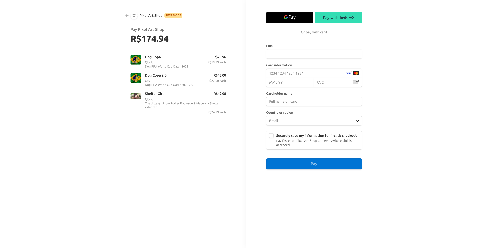

# PixelArt Shop

  
  

  
  
  
  

> E-commerce of my pixel arts with payment managed by Stripe. So yes, it is safe.

**If you want to support me, you can ["buy"](https://pixelart-shop.vercel.app/) some of my arts :D**
